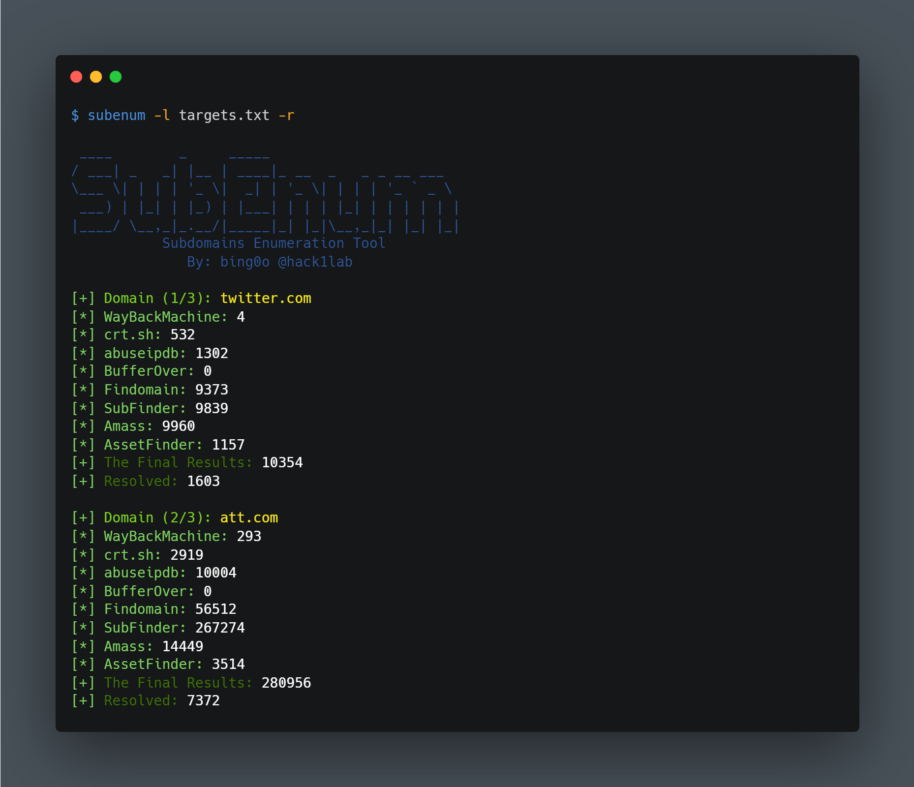

## Description:
<!-- ALL-CONTRIBUTORS-BADGE:START - Do not remove or modify this section -->
[](#contributors-)
<!-- ALL-CONTRIBUTORS-BADGE:END -->

bash script for Subdomain Enumeration using 4 tools and 3 online services, you have to install these tools by yourself to be able to use SubEnum.sh, or use [setup.sh](https://github.com/bing0o/SubEnum/blob/master/setup.sh) script to install them.



### Available Tools and online services:

1. Tools:
	- [Findomain](https://github.com/Edu4rdSHL/findomain)
	- [SubFinder](https://github.com/projectdiscovery/subfinder)
	- [Amass](https://github.com/OWASP/Amass)
	- [AssetFinder](https://github.com/tomnomnom/assetfinder)
	- [Httprobe](https://github.com/tomnomnom/httprobe): To Probe For Working HTTP and HTTPS Subdomains.
	- [anew](https://github.com/tomnomnom/anew): To delete duplicates when using -s/--silent option.
1. online services:
	- [WayBackMachine](http://web.archive.org/)
	- [crt.sh](https://crt.sh/)
	- [BufferOver](https://dns.bufferover.run/)

## Installation:

to install the dependencies run:

```bash
$ git clone https://github.com/bing0o/SubEnum.git
$ cd SubEnum
$ chmod +x setup.sh
$ ./setup.sh
```

## Usage:

### Basic usage:

```bash
$ subenum -d target.com 
```

### Resolve The Found Subdomains:

```bash
$ subenum -d target.com -r 
```

### Agains a list of domains

```bash
$ subenum -l domains.txt -r
```

### Exclude:

```bash
$ subenum -d target.com -e Amass,wayback
```

### Use:

```bash
$ subenum -d target.com -u Findomain,Subfinder
```

exclude and use can be used with list of domains too 

```bash
$ subenum -l domains.txt -u crt,bufferover
```

### Parallel:
the tool `parallel` must be installed on you system, it runs all the functions at the same time which make the results faster, doesn't work with -u/--use or -e/--exclude options.

```bash
$ subenum -d target.com -p
```


### Silent:

this option helps when you want to pipe the results to another tool, or just to avoid the useless output.

```bash
$ subenum -d target.com -s 
dev.target.com
admin.target.com
api.target.com
..
..
```

happy hacking!


## Spport:

You can support me here:

<a href="https://www.buymeacoffee.com/bing0o" target="_blank"></a>

## Contributors ✨

Thanks goes to these wonderful people ([emoji key](https://allcontributors.org/docs/en/emoji-key)):

<!-- ALL-CONTRIBUTORS-LIST:START - Do not remove or modify this section -->
<!-- prettier-ignore-start -->
<!-- markdownlint-disable -->
<table>
  <tr>
    <td align="center"><a href="https://github.com/secfb"><br /><sub><b>Never Mind</b></sub></a><br /><a href="https://github.com/bing0o/SubEnum/commits?author=secfb" title="Code">💻</a></td>
    <td align="center"><a href="https://github.com/mehedi1194"><br /><sub><b>Mehedi Hasan Remon</b></sub></a><br /><a href="https://github.com/bing0o/SubEnum/commits?author=mehedi1194" title="Code">💻</a></td>
    <td align="center"><a href="http://alins.ir"><br /><sub><b>alins.ir</b></sub></a><br /><a href="https://github.com/bing0o/SubEnum/commits?author=alins1r" title="Code">💻</a></td>
    <td align="center"><a href="https://0xhunster.github.io"><br /><sub><b>Akash Sarkar</b></sub></a><br /><a href="https://github.com/bing0o/SubEnum/commits?author=0xhunster" title="Code">💻</a></td>
    <td align="center"><a href="https://twitter.com/cihanmehmets"><br /><sub><b>Cihan Mehmet DOĞAN (CMD)</b></sub></a><br /><a href="https://github.com/bing0o/SubEnum/commits?author=cihanmehmet" title="Code">💻</a></td>
  </tr>
</table>

<!-- markdownlint-restore -->
<!-- prettier-ignore-end -->

<!-- ALL-CONTRIBUTORS-LIST:END -->

This project follows the [all-contributors](https://github.com/all-contributors/all-contributors) specification. Contributions of any kind welcome!
